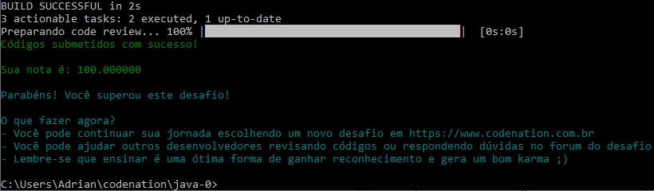
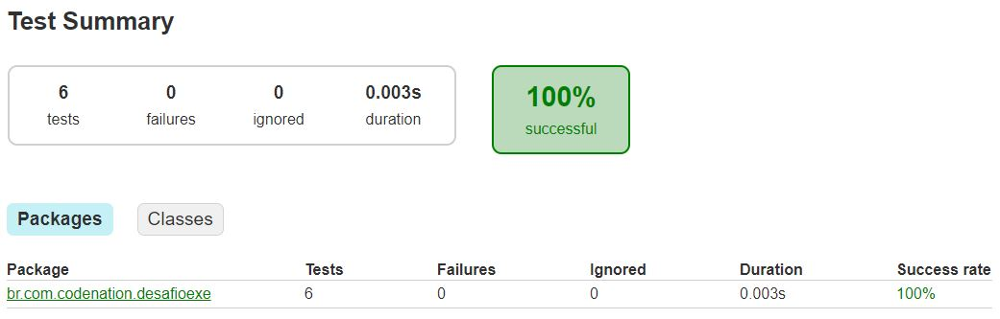

# Fibonacci

Faça um método `@Desafio("Fibonacci")` que retorne uma lista `java.util.List` com os primeiro números `Integer` da série de *Fibonacci* até *passar* de *350*.

> A série de Fibonacci é a seguinte: 0, 1, 1, 2, 3, 5, 8, 13, etc...

Faça um segundo método `@Desafio("isFibonnaci")` que recebe um `Integer` como parâmetro e retorne `Boolean`.
Caso o número recebido por parâmetro esteja entre os números da sequência de *Fibonnaci* do `@Desafio("Fibonnaci")` retorne `true`, senão, `false`.

# Resultado submetido

